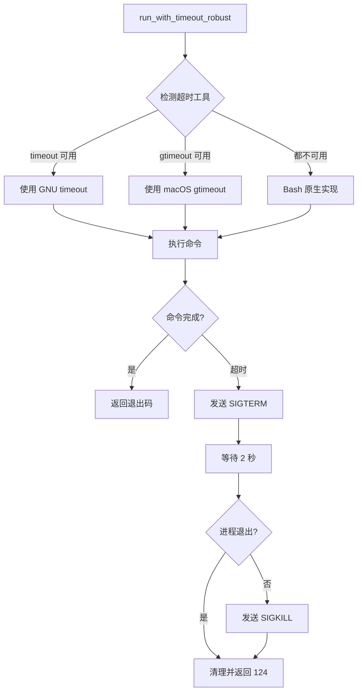
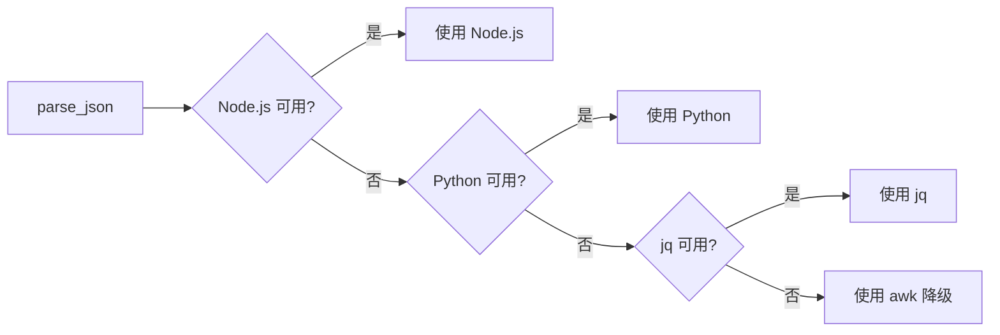
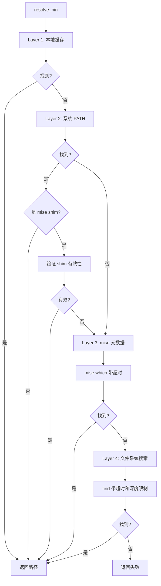

# Scripts 重构设计文档

## 1. 架构设计

### 1.1 整体架构

```
scripts/lib/
├── common.sh              # 核心库（重构重点）
├── timeout.sh             # 新增：超时机制模块
├── json-parser.sh         # 新增：JSON 解析模块
├── process-manager.sh     # 新增：进程管理模块
├── bin-resolver.sh        # 新增：bin 解析模块
├── bootstrap.sh           # 保持不变
├── versions.sh            # 保持不变
└── langs/                 # 语言特定模块（保持不变）
```

### 1.2 模块职责

#### 1.2.1 timeout.sh - 超时机制

- 提供统一的超时执行函数
- 支持多种超时实现（timeout, gtimeout, bash native）
- 进程组管理和清理
- 信号处理（SIGTERM → SIGKILL）

#### 1.2.2 json-parser.sh - JSON 解析

- Node.js 解析器（优先）
- Python 解析器（后备）
- awk 解析器（降级）
- 自动选择最佳解析器

#### 1.2.3 process-manager.sh - 进程管理

- 进程启动和监控
- 僵尸进程清理
- 进程组管理
- 资源限制

#### 1.2.4 bin-resolver.sh - Bin 解析

- 分层查找策略
- 缓存机制
- 超时保护
- 调试日志

## 2. 核心组件设计

### 2.1 超时机制设计

#### 2.1.1 函数签名

```sh
# Purpose: 执行命令并在超时后终止
# Params:
#   $1 - 超时时间（秒）
#   $2+ - 要执行的命令和参数
# Returns:
#   命令的退出码，或 124（超时）
# Examples:
#   run_with_timeout_robust 5 curl https://example.com
run_with_timeout_robust() { ... }
```

#### 2.1.2 实现策略



#### 2.1.3 进程组管理

```sh
# 使用 setsid 创建新进程组（如果可用）
if command -v setsid >/dev/null 2>&1; then
    setsid "$@" &
    _PID=$!
else
    # 降级：使用子 shell
    ("$@") &
    _PID=$!
fi
```

### 2.2 JSON 解析设计

#### 2.2.1 解析器选择策略



#### 2.2.2 Node.js 解析器

```javascript
// scripts/lib/json-parser.js
const fs = require("fs");

function parseJson(jsonStr, query) {
  try {
    const data = JSON.parse(jsonStr);
    return evaluateQuery(data, query);
  } catch (e) {
    process.exit(1);
  }
}

// 支持简单的 JSONPath 查询
// 例如: "tools.node.version"
function evaluateQuery(data, query) {
  const parts = query.split(".");
  let result = data;
  for (const part of parts) {
    if (result === undefined) return null;
    result = result[part];
  }
  return result;
}

const [jsonStr, query] = process.argv.slice(2);
const result = parseJson(jsonStr, query);
console.log(result !== undefined ? result : "");
```

#### 2.2.3 Python 解析器

```python
#!/usr/bin/env python3
# scripts/lib/json-parser.py
import json
import sys

def parse_json(json_str, query):
    try:
        data = json.loads(json_str)
        return evaluate_query(data, query)
    except Exception:
        sys.exit(1)

def evaluate_query(data, query):
    parts = query.split('.')
    result = data
    for part in parts:
        if result is None:
            return None
        result = result.get(part) if isinstance(result, dict) else None
    return result

if __name__ == '__main__':
    json_str, query = sys.argv[1], sys.argv[2]
    result = parse_json(json_str, query)
    print(result if result is not None else '')
```

#### 2.2.4 Shell 包装函数

```sh
# Purpose: 解析 JSON 字符串并提取值
# Params:
#   $1 - JSON 字符串
#   $2 - 查询路径（例如：tools.node.version）
# Returns:
#   提取的值，或空字符串
# Examples:
#   VAL=$(parse_json "$JSON" "tools.node.version")
parse_json() {
    local _JSON="${1:-}"
    local _QUERY="${2:-}"

 # 超时保护
    local _TIMEOUT=3

    # 优先使用 Node.js
    if command -v node >/dev/null 2>&1; then
        echo "$_JSON" | run_with_timeout_robust $_TIMEOUT \
            node "${_G_LIB_DIR}/json-parser.js" "$_QUERY" 2>/dev/null
        return $?
    fi

    # 后备：Python
    if command -v python3 >/dev/null 2>&1; then
        echo "$_JSON" | run_with_timeout_robust $_TIMEOUT \
            python3 "${_G_LIB_DIR}/json-parser.py" "$_QUERY" 2>/dev/null
        return $?
    fi

    # 降级：awk（保留现有实现）
    # ... 现有 awk 代码 ...
}
```

### 2.3 resolve_bin 重构设计

#### 2.3.1 分层查找策略



#### 2.3.2 缓存机制

```sh
# 全局缓存：避免重复查找
declare -A _G_BIN_CACHE

# Purpose: 带缓存的 bin 解析
resolve_bin_cached() {
    local _BIN="${1:-}"

    # 检查缓存
    if [ -n "${_G_BIN_CACHE[$_BIN]:-}" ]; then
        echo "${_G_BIN_CACHE[$_BIN]}"
        return 0
    fi

    # 执行查找
    local _RESULT
    _RESULT=$(resolve_bin_impl "$_BIN")
    local _RET=$?

    # 缓存结果（包括失败）
    if [ $_RET -eq 0 ]; then
        _G_BIN_CACHE[$_BIN]="$_RESULT"
        echo "$_RESULT"
    fi

    return $_RET
}
```

#### 2.3.3 超时配置

```sh
# 每层查找的超时时间
TIMEOUT_LAYER_1=0      # 本地缓存：无超时
TIMEOUT_LAYER_2=1      # 系统 PATH：1 秒
TIMEOUT_LAYER_3=5      # mise 元数据：5 秒
TIMEOUT_LAYER_4=10     # 文件系统：10 秒
```

### 2.4 进程管理设计

#### 2.4.1 进程清理函数

```sh
# Purpose: 清理进程及其所有子进程
# Params:
#   $1 - 进程 PID
#   $2 - 超时时间（秒，默认 3）
# Examples:
#   cleanup_process_tree 12345 5
cleanup_process_tree() {
    local _PID="${1:-}"
    local _TIMEOUT="${2:-3}"

    [ -z "$_PID" ] && return 0

    # 1. 发送 SIGTERM
    kill -TERM "$_PID" 2>/dev/null || return 0

    # 2.等待进程退出
    local _WAITED=0
    while [ $_WAITED -lt $_TIMEOUT ]; do
        if ! kill -0 "$_PID" 2>/dev/null; then
            return 0
        fi
        sleep 1
        _WAITED=$((_WAITED + 1))
    done

    # 3. 强制终止
    kill -KILL "$_PID" 2>/dev/null || true

    # 4. 清理子进程
    pkill -KILL -P "$_PID" 2>/dev/null || true
}
```

## 3. 数据流设计

### 3.1 resolve_bin 数据流

```
输入: 二进制名称 (例如: "eslint")
  ↓
Layer 1: 检查 .venv/bin/, node_modules/.bin/
  ↓ (未找到)
Layer 2: 检查 $PATH
  ↓ (未找到或是无效 shim)
Layer 3: 查询 mise 元数据 (带超时)
  ↓ (未找到)
Layer 4: 文件系统搜索 (带超时和深度限制)
  ↓
输出: 绝对路径 或 失败 (exit 1)
```

### 3.2 JSON 解析数据流

```
输入: JSON 字符串 + 查询路径
  ↓
选择解析器 (Node.js > Python > jq > awk)
  ↓
执行解析 (带超时)
  ↓
输出: 提取的值 或 空字符串
```

## 4. 错误处理设计

### 4.1 错误分类

| 错误类型     | 处理策略           | 示例             |
| ------------ | ------------------ | ---------------- |
| 超时         | 清理进程，返回 124 | mise which 超时  |
| 命令不存在   | 降级到下一层       | Node.js 不可用   |
| 权限错误     | 记录警告，继续     | 无法访问某个目录 |
| 数据格式错误 | 返回空值           | JSON 解析失败    |

### 4.2 日志级别

```sh
# 根据 VERBOSE 级别输出不同详细程度的日志
log_resolve_debug() {
    [ "${VERBOSE:-1}" -ge 2 ] && log_debug "$@"
}

log_resolve_info() {
    [ "${VERBOSE:-1}" -ge 1 ] && log_info "$@"
}
```

## 5. 性能优化设计

### 5.1 缓存策略

- **内存缓存**：resolve_bin 结果缓存在关联数组
- **文件缓存**：mise ls --json 结果缓存（已有）
- **缓存失效**：mise install 后自动刷新

### 5.2 并行化

```sh
# 在安全的情况下并行执行查找
resolve_bin_parallel() {
    local _BIN="${1:-}"

    # 启动多个查找层（后台）
    (check_venv "$_BIN") &
    local _PID1=$!

    (check_node_modules "$_BIN") &
    local _PID2=$!

    # 等待第一个成功的结果
    wait -n $_PID1 $_PID2
}
```

### 5.3 早期退出

```sh
# 每层查找成功后立即返回，不继续后续层
for layer in layer1 layer2 layer3 layer4; do
    result=$($layer "$bin")
    [ -n "$result" ] && echo "$result" && return 0
done
```

## 6. 安全设计

### 6.1 路径注入防护

```sh
# 验证路径安全性
is_safe_path() {
    local _PATH="${1:-}"

    # 拒绝包含危险字符的路径
    case "$_PATH" in
        *\;*|*\&*|*\|*|*\$*|*\`*)
            return 1
            ;;
    esac

    # 确保路径存在且可执行
    [ -x "$_PATH" ]
}
```

### 6.2 命令注入防护

```sh
# 使用数组传递参数（Bash）
run_safe() {
    local -a cmd=("$@")
    "${cmd[@]}"
}

# POSIX sh:严格引用
run_safe_posix() {
    "$@"  # 不使用 eval
}
```

## 7. 测试设计

### 7.1 单元测试结构

```
tests/
├── unit/
│   ├── test_timeout.bats
│   ├── test_json_parser.bats
│   ├── test_resolve_bin.bats
│   └── test_process_manager.bats
├── integration/
│   ├── test_setup_flow.bats
│   └── test_ci_simulation.bats
└── fixtures/
    ├── mock_binaries/
    └── test_data.json
```

### 7.2 测试用例示例

```bats
# tests/unit/test_timeout.bats
@test "run_with_timeout_robust: 正常命令" {
    run run_with_timeout_robust 5 echo "hello"
    [ "$status" -eq 0 ]
    [ "$output" = "hello" ]
}

@test "run_with_timeout_robust: 超时命令" {
    run run_with_timeout_robust 1 sleep 10
    [ "$status" -eq 124 ]
}

@test "run_with_timeout_robust: 清理子进程" {
    run run_with_timeout_robust 1 bash -c 'sleep 100 & sleep 100'
    [ "$status" -eq 124 ]
    # 验证没有残留进程
    ! pgrep -f "sleep 100"
}
```

## 8. 部署设计

### 8.1 渐进式部署

1. **Alpha 版本**：内部测试，feature flag 控制
2. **Beta 版本**：部分用户，可选启用
3. **GA 版本**：全面发布，默认启用

### 8.2 Feature Flag

```sh
# 使用环境变量控制新功能
USE_NEW_RESOLVE_BIN="${USE_NEW_RESOLVE_BIN:-1}"

resolve_bin() {
    if [ "$USE_NEW_RESOLVE_BIN" = "1" ]; then
        resolve_bin_v2 "$@"
    else
        resolve_bin_v1 "$@"
    fi
}
```

## 9. 监控和调试

### 9.1 性能监控

```sh
# 记录每次 resolve_bin 的耗时
_resolve_bin_stats() {
    local _START=$(date +%s%N)
    resolve_bin "$@"
    local _RET=$?
    local _END=$(date +%s%N)
    local _DURATION=$(( (_END - _START) / 1000000 ))  # ms

    log_debug "resolve_bin('$1'): ${_DURATION}ms, exit=$_RET"
return $_RET
}
```

### 9.2 调试模式

```sh
# DEBUG_RESOLVE_BIN=1 启用详细日志
if [ "${DEBUG_RESOLVE_BIN:-0}" = "1" ]; then
    set -x
    export PS4='+ [${BASH_SOURCE}:${LINENO}] '
fi
```

## 10. 文档设计

### 10.1 API 文档

每个函数必须包含：

- Purpose: 功能描述
- Params: 参数说明
- Returns: 返回值说明
- Examples: 使用示例
- Notes: 注意事项

### 10.2 故障排查指南

```markdown
## 常见问题

### resolve_bin 找不到工具

1. 检查工具是否已安装：`mise ls`
2. 检查 PATH：`echo $PATH`
3. 启用调试：`DEBUG_RESOLVE_BIN=1 ./script.sh`
4. 查看缓存：`cat /tmp/.mise_ls_cache`

### 脚本挂起

1. 检查超时配置：`echo $TIMEOUT_*`
2. 查看进程树：`pstree -p $$`
3. 强制终止：`pkill -TERM -P $$`
```
