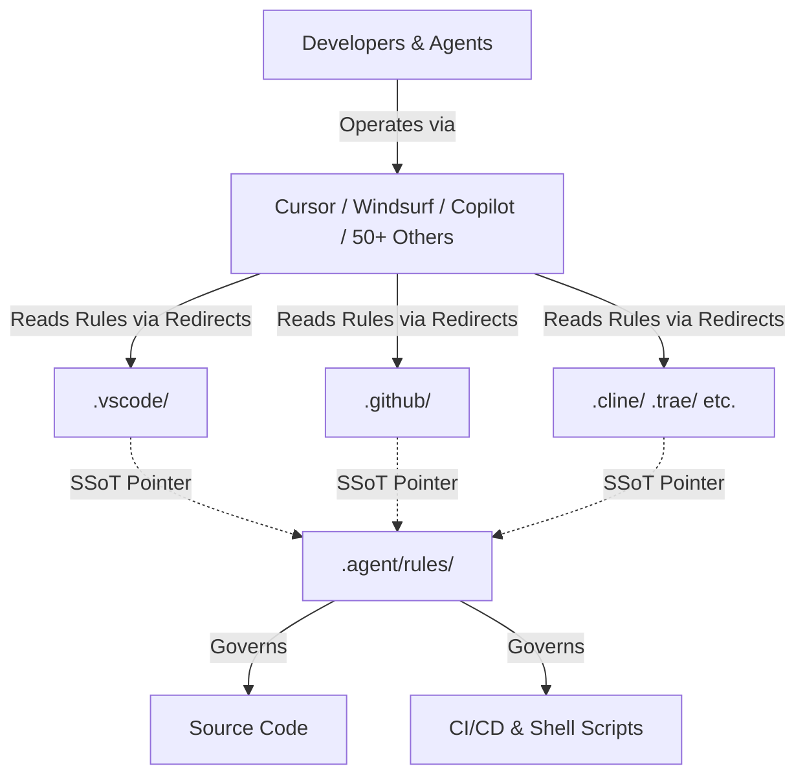

# Snowdream Tech AI IDE Template

[](https://github.com/snowdreamtech/template/actions/workflows/lint.yml)
[](https://github.com/snowdreamtech/template/actions/workflows/verify.yml)
[](https://github.com/snowdreamtech/template/releases/latest)
[](https://opensource.org/licenses/MIT)
[](https://github.com/snowdreamtech/template)
[](https://github.com/snowdreamtech/template/blob/main/.github/dependabot.yml)

[English](README.md) | [简体中文](README_zh-CN.md)

An enterprise-grade, foundational template designed for multi-AI IDE collaboration. This repository serves as a **Single Source of Truth** for AI agent rules, workflows, and project configurations, supporting over 50 different AI-assisted IDEs with massive multi-language support.

## 🏗️ Section 1 — Design & Architecture

The Snowdream Tech Template is architected to solve the "N-IDE Fragmentation" problem, ensuring that rules and workflows remain consistent across all supported environments.



### Design Principles

- **Single Source of Truth (SSoT)**: All AI rules, commands, and Git hooks live in one place. No duplicated IDE configurations.
- **Cross-Platform Portability**: Heavy automation logic is written in POSIX Shell, with thin wrappers for Windows PowerShell/Batch.
- **Triple Guarantee Quality**: Linting and formatting form an impenetrable wall, enforced at the IDE layer, pre-commit layer, and CI/CD GitHub Actions layer.

### Responsibilities

- **.agent/rules/**: Owns the definitive behavioral logic for AI agents across all supported languages.
- **scripts/**: Owns the cross-platform automation and lifecycle logic.
- **.agent/workflows/**: Owns the interactive AI commands (SpecKit).

---

## 📖 Section 2 — Usage Guide

### Prerequisites

- **Runtime**: Node.js (>= 20.x), Python (>= 3.10.x).
- **Git**: Global git installation required.

### Quick Start

1. **Prerequisites**: [mise](https://mise.jdx.dev/) is highly recommended for global tool management (automatically installed during setup).
2. **Initialize**: `make setup` (bootstraps mise and core tools).
3. **Install**: `make install` (installs project dependencies).
4. **Verify**: `make verify` (ensures everything is green).

### Configuration Reference

| Parameter      | Purpose              | Location                |
| :------------- | :------------------- | :---------------------- |
| `PROJECT_NAME` | Project identity     | `init-project.sh`       |
| `GITHUB_PROXY` | Network optimization | `scripts/lib/common.sh` |
| `VERSION`      | Semantic versioning  | `package.json`          |

### File Structure

```text
project-root/
├── .agent/              # 🤖 Canonical AI configuration (The Brain)
│   ├── rules/           # 📏 Unified AI behavioral rules (80+ sets, SSoT)
│   └── workflows/       # 🛠️ Unified commands & AI workflows (SpecKit)
├── .agents/             # 🧩 Shared command sources (Auto-managed symlinks)
├── .github/             # 🐙 GitHub integration & Copilot settings
├── .vscode/             # 💻 Optimized VS Code configurations
└── src/                 # 📦 Your actual application source code
```

---

## 🛠️ Section 3 — Operations Guide

### Pre-deployment Checklist

1. Run `make verify` to ensure all quality gates are green.
2. Run `make audit` to verify security compliance.
3. Ensure `CHANGELOG.md` is updated.

### Performance Considerations

- **Linting Speed**: Pre-commit hooks target < 5s by scanning staged files only.
- **CI Throughput**: GitHub Actions use matrix builds for parallel testing across OS types.

### Troubleshooting

- **Problem**: `make install` fails on Windows.
  - **Diagnosis**: Check if `ExecutionPolicy` allows script execution.
  - **Solution**: Run `Set-ExecutionPolicy -Scope Process -ExecutionPolicy Bypass`.
- **Problem**: Gitleaks detects false positives.
  - **Diagnosis**: Check `.gitleaks.toml` allowlist.
  - **Solution**: Add fingerprint to `.gitleaksignore`.

---

## 🔒 Section 4 — Security Considerations

### Security Model

- **Secret Management**: All secrets must be injected via environment variables or handled by HashiCorp Vault. Never commit `.env` files.
- **Audit Logging**: All critical operations (commits, releases, state changes) are traced via Git and CI logs.
- **Supply Chain**: All CI actions are pinned to exact versions/SHAs.

### Best Practices

| Aspect      | Requirement                  | Implementation                    |
| :---------- | :--------------------------- | :-------------------------------- |
| Secrets     | No plaintext secrets in repo | `gitleaks` enforced at commit     |
| Integrity   | Verify downloads             | SHA-256 validation in `common.sh` |
| Permissions | Non-root execution           | Dockerfile best practices         |

---

## 🧑‍💻 Section 5 — Development Guide

### Extension Points

1. **Adding Rules**: Create a new `.md` file in `.agent/rules/` and link it in `00-index.md`.
2. **Adding Commands**: Add `.md` files to `.agent/workflows/`.
3. **Adding IDE Support**: Create a redirect folder (e.g., `.myide/`) following the symlink pattern in Rule 03.

### Local Development Setup

```bash
git clone <repo>
make setup
make install
```

### References

- [Full Documentation](docs/index.md)
- [Project Glossary](docs/glossary.md)
- [Conventional Commits](https://www.conventionalcommits.org/)

## 📄 License

This project is licensed under the **MIT License**.
Copyright (c) 2026-present [SnowdreamTech Inc.](https://github.com/snowdreamtech)
See the [LICENSE](./LICENSE) file for the full license text.
